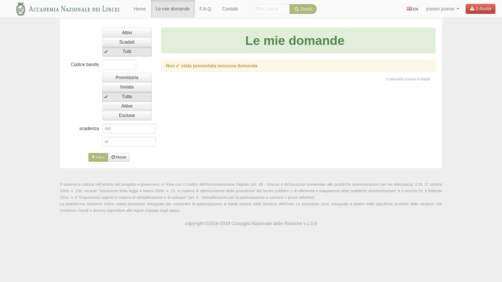

=======
Domande
=======

Solo quando il candidato ha effettuato l’accesso in procedura, sarà visibile nella barra di navigazione anche la voce "Le mie domande" che consente di accedere
ad un’area utente personale dove sono memorizzate tutte le domande già presentate e quelle in fase di compilazione, sia provvisorie che definitive.

Utilizzando il menù a tendina che si attiva accanto a ciascuna domanda, sarà sempre possibile stampare la domanda stessa, visualizzare gli allegati ad essa associati, copiare l’intera domanda.
Inoltre, se la domanda è ancora in stato *Provvisoria*, sarà possibile anche modificarla :

Se, invece, la domanda è in stato *Inviata*, sarà possibile, *se non sono ancora scaduti i termini del bando*, *riaprila*, effettuare tutte le modifiche necessarie ed inviarla nuovamente.

Copia domanda
=============

Attraverso quest’area personale predisposta per ciascun candidato, è anche possibile effettuare la copia di una domanda precedentemente inserita per la partecipazione ad un altro Bando;
considerate le peculiarità di ciascun bando, la copia sarà consentita solo tra bandi aventi la stessa tipologia (Bandi pubblici, Premi o Borse)
e verranno copiate solo le informazioni richieste nel bando di arrivo.

Di seguito sono descritti i passi operativi da dover effettuare.
Una volta individuata la domanda che si desidera copiare, nel menù a tendina posto accanto ad ogni domanda, selezionare la scelta "Copia domanda"

Tale scelta attiva una nuova pagina nella quale sono elencati tutti i bandi attivi per i quali è possibile effettuare la copia della domanda.

Se, poi, si desidera effettuare la copia su un bando completamente diverso da quello di partenza, per visualizzare tutti i bandi attivi della stessa tipologia,
è sufficiente selezionare la scelta *Visualizza tutti i bandi*

Una volta individuato il bando (o il dettaglio del bando) che interessa, cliccando su "Incolla domanda"
il sistema chiederà conferma della copia

e, in caso di risposta affermativa, verrà creata una domanda PROVVISORIA, copia della domanda di partenza, qualunque sia lo stato in cui essa si trovi.
Se risulta già presente una domanda per il bando selezionato, il sistema avvertirà con un messaggio il candidato che per poter effettuare la copia dovrà
prima eliminare la domanda già inserita.
