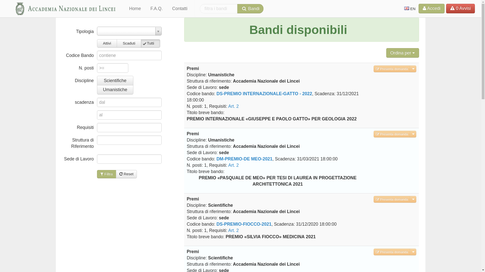

=========
Home page
=========

All’indirizzo `https://selezionionline.lincei.it <https://selezionionline.lincei.it/>`_ è disponibile la procedura "Selezioni online", il sistema di presentazione di candidature online dell'Accademia Nazionale dei Lincei.

All’attivazione della suddetta procedura, la barra di navigazione presenta una serie di funzionalità di seguito descritte.
Innanzitutto è opportuno far presente che tale barra di navigazione assume una visualizzazione piuttosto che un’altra a seconda che l’utente sia loggato o meno
ed a seconda del dispositivo utilizzato per l’accesso alla procedura (personal computer, tablet, telefonino,….) o del tipo di browser. come
di seguito illustrato, a seconda delle dimensioni del video, gli elementi della barra appaiono per esteso oppure inseriti sotto la voce "Altro":

In questa pagina è possibile visualizzare tutti i bandi gestiti online, sia ancora attivi sia già scaduti, divisi per tipologia (Bandi per Concorsi Pubblici, Borse e Premi). Inizialmente la pagina si imposta sulla scelta "Tutti i Bandi"/"Attivi" che consente così la visualizzazione di tutti i bandi disponibili online, ancora attivi, qualunque tipologia essi abbiano.

Per restringere la ricerca è possibile scegliere la tipologia del bando desiderata, ad esempio "Concorsi Pubblici" che consente così la visualizzazione solo dei bandi predisposti per i concorsi pubblici.
E’ possibile effettuare altri filtri sui bandi che si vuole visualizzare utilizzando i bottoni Attivi, Scaduti , Tutti oppure inserendo, ad esempio, parte del codice bando ed effettuando la ricerca utilizzando "Cerca bandi":
