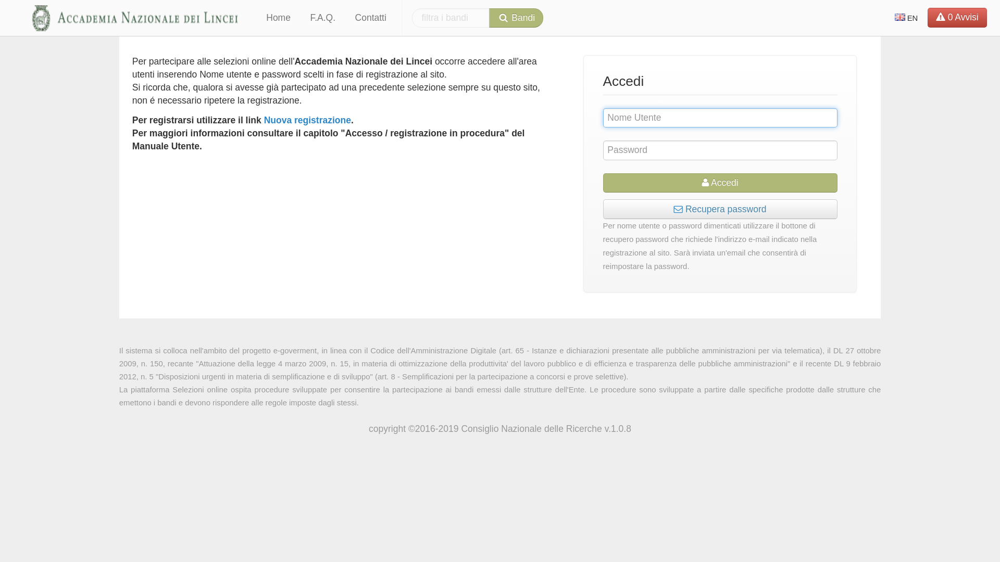
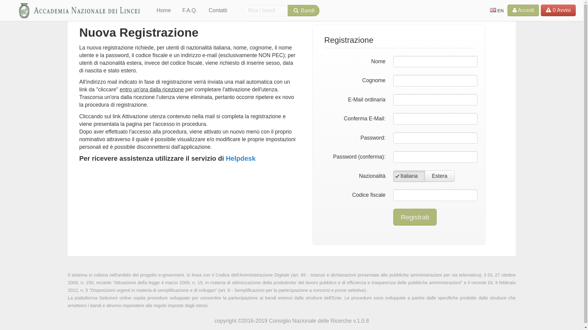

====================================
Accesso / Registrazione
====================================

Come prima cosa occorre accedere/registrarsi con le proprie credenziali.

L’accesso in procedura avviene attraverso la seguente pagina.

Nuova Registrazione
===================

La nuova registrazione richiede l’inserimento dei propri dati anagrafici, la scelta di una password, del codice fiscale e di un indirizzo EMail
(esclusivamente **NON** PEC).
Il sistema controllerà, attraverso il Codice Fiscale, che la stessa persona non abbia già effettuato in precedenza la registrazione nel sistema.

Il sistema genererà **in automatico** un "nome utente" per l’accesso in procedura nel formato "nome.cognome" salvo nei casi di omonimia,
tale nome utente sarà inviato nella stessa email di conferma dell’utenza.

Per utenti di nazionalità estera, invece del codice fiscale, viene richiesto di inserire sesso, data di nascita e stato estero.
All’indirizzo mail indicato in fase di registrazione verrà inviata una mail automatica con un link da "cliccare" per completare l’attivazione dell’utenza

.. important::

    Il link per l'attivazione è stato inviato all'indirizzo EMail indicato.

Cliccando sul link *Attivazione utenza* contenuto nella mail si completa la registrazione e viene presentata la pagina per l’accesso in procedura.
Dopo aver effettuato l’accesso in procedura, viene attivato un nuovo menù con il proprio nominativo attraverso il quale è possibile visualizzare e/o modificare
le proprie impostazioni personale ed è possibile disconnettersi dall’applicazione.
